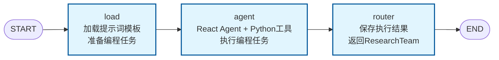

# Deer Flow Go 项目架构图

## 项目概述

`deer-flow-go` 是一个基于 CloudWeGo Eino 框架构建的多智能体协作系统，采用有向无环图(DAG)架构设计，实现了智能任务分发、计划生成、研究执行和报告生成的完整工作流程。

### 项目目录结构


```
deer-flow-go/
├── agent/                 # Agent 实现
│   ├── agent.go          # Agent 接口定义
│   ├── coordinator/      # 协调员角色
│   │   └── coordinator.go
│   ├── planner/          # 规划师角色
│   │   └── planner.go
│   ├── researcher/       # 研究员角色
│   │   ├── researcher.go
│   │   └── research_team.go
│   ├── coder/            # 编码员角色
│   │   └── coder.go
│   ├── repoter/          # 报告员角色
│   │   └── repoter.go
│   ├── investigator/     # 背景调查员角色
│   │   └── investigator.go
│   ├── human/            # 人工反馈处理
│   │   └── human.go
│   └── comm/             # 通用组件
│       └── comm.go
├── entity/               # 数据实体
│   ├── conf/             # 配置结构体
│   │   ├── conf.go
│   │   └── types.go
│   ├── consts/           # 常量定义
│   │   └── consts.go
│   └── model/            # 数据模型
│       ├── plan.go
│       ├── server.go
│       └── state.go
├── repo/                 # 基础设施层
│   ├── callback/         # 回调处理
│   │   └── logger_callback.go
│   ├── checkpoint/       # 检查点管理
│   │   └── checkpoint.go
│   ├── llm/              # LLM 模型服务
│   │   └── llm.go
│   ├── mcp/              # MCP 工具集成
│   │   ├── mcp.go
│   │   └── types.go
│   └── template/         # 模板管理
│       └── template.go
├── mcps/                 # MCP 服务器
│   └── python/           # Python MCP 服务器
│       ├── server.py
│       ├── pyproject.toml
│       └── uv.lock
├── prompts/              # 提示词模板
│   ├── coordinator.md
│   ├── planner.md
│   ├── researcher.md
│   ├── coder.md
│   └── reporter.md
├── docs/                 # 项目文档
│   ├── README.md
│   ├── architecture/
│   │   └── architecture.md
│   └── generics/
│       ├── golang-generics-guide.md
│       ├── generics-usage-analysis.md
│       ├── go-generics-type-erasure.md
│       └── generics-demo.go
├── config.yaml.example   # 配置文件模板
├── config.yaml          # 配置文件
├── main.go              # 程序入口
├── go.mod               # Go 模块文件
├── go.sum               # Go 依赖锁定文件
└── script/              # 脚本文件
    └── bootstrap.sh
```


## 系统架构

### 核心组件

1. **Coordinator (协调器)**: 任务分发中心，负责检测用户语言和任务类型
2. **BackgroundInvestigator (背景调查员)**: 使用 MCP 工具进行背景信息搜索
3. **Planner (计划员)**: 根据用户输入和背景信息生成执行计划
4. **HumanFeedback (人工反馈)**: 处理用户对计划的反馈和修改
5. **ResearchTeam (研究团队)**: 任务路由中心，根据步骤类型分发任务
6. **Researcher (研究员)**: 执行研究类型的任务
7. **Coder (编程员)**: 执行编程类型的任务
8. **Reporter (报告员)**: 汇总所有结果生成最终报告

### 工作流程图


## 技术实现细节

### 节点内部结构分析

每个 Agent 节点内部都采用了 **chain（链式）结构**，这是一个线性的处理流程，没有复杂的分支或循环。所有 Agent 都遵循相同的三段式模式：

1. **load 节点**: 加载提示词模板和准备输入数据
2. **agent 节点**: 执行 AI 模型推理（可能是简单的 ChatModel 或复杂的 React Agent）
3. **router 节点**: 根据结果决定下一步路由

### 各节点内部流程图

#### 1. Coordinator (协调器) 内部流程


#### 2. BackgroundInvestigator (背景调查员) 内部流程


#### 3. Planner (计划员) 内部流程


#### 4. HumanFeedback (人工反馈) 内部流程


#### 5. ResearchTeam (研究团队) 内部流程


#### 6. Researcher (研究员) 内部流程


#### 7. Coder (编程员) 内部流程



#### 8. Reporter (报告员) 内部流程


### 状态管理

系统使用 `State` 结构体管理整个工作流程的状态，包括：
- `Messages`: 用户输入消息
- `CurrentPlan`: 当前执行计划
- `Locale`: 用户语言设置
- `BackgroundInvestigationResults`: 背景调查结果
- `Goto`: 下一个执行节点
- `PlanIterations`: 计划迭代次数
- `MaxPlanIterations`: 最大计划迭代次数

### 图构建模式特点

1. **统一的 Chain 结构**: 所有 Agent 都采用线性的链式结构，没有内部分支
2. **三段式处理**: load → agent → router 的标准模式
3. **状态驱动**: 通过 `compose.ProcessState` 处理状态更新
4. **工具集成**: Researcher 和 Coder 使用 React Agent 集成 MCP 工具
5. **简单路由**: router 节点负责简单的下一步决策，不包含复杂逻辑

### MCP 工具集成

系统集成了 MCP (Model Context Protocol) 工具，支持：
- 搜索工具 (tavily)
- Python 执行环境
- 其他扩展工具

### 关键决策点

1. **Coordinator**: 根据 `EnableBackgroundInvestigation` 配置决定是否启用背景调查
2. **Planner**: 根据 `HasEnoughContext` 判断是否需要更多信息
3. **Human**: 根据用户反馈 (`AcceptPlan` 或 `EditPlan`) 决定流程走向
4. **ResearchTeam**: 根据步骤类型 (`Research` 或 `Processing`) 分发任务

## 配置参数

- `max_step_num`: 最大步骤数
- `max_plan_iterations`: 最大计划迭代次数
- `enable_background_investigation`: 是否启用背景调查
- `auto_accepted_plan`: 是否自动接受计划

## 扩展性

系统设计具有良好的扩展性：
- 可以轻松添加新的 Agent 节点
- 支持动态加载 MCP 工具
- 模块化的图结构便于维护和扩展
- 类型安全的状态管理机制

## 参考文档

- [CloudWeGo Eino 编排设计原则](https://www.cloudwego.io/zh/docs/eino/core_modules/chain_and_graph_orchestration/orchestration_design_principles/)
- [项目 README](../README.md)