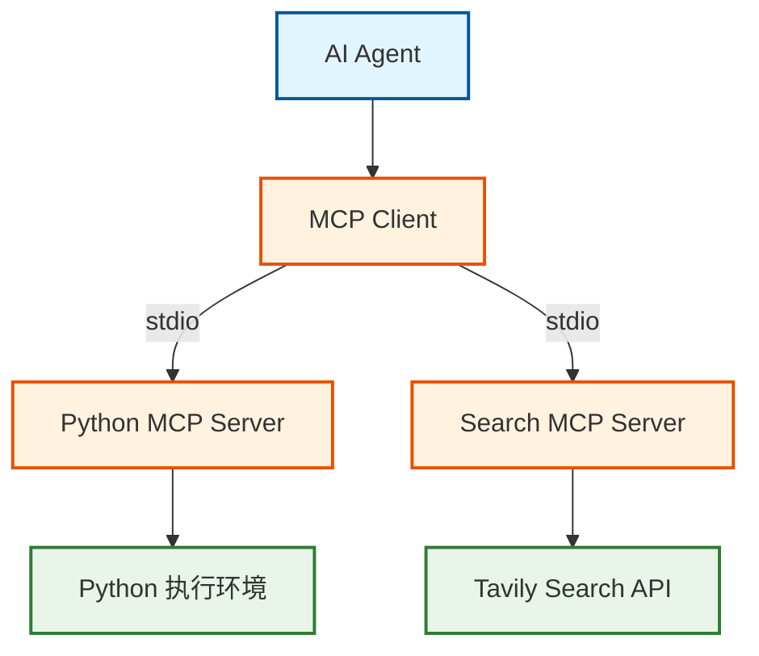

# MCP (Model Context Protocol) 集成文档

## 概述

`deer-flow-go` 项目集成了 MCP (Model Context Protocol) 协议，通过 MCP 服务器为 AI Agent 提供各种工具能力，包括搜索、Python 代码执行等功能。

## MCP 架构

### 系统架构图



## MCP 服务器实现

### Python MCP 服务器

位置：`mcps/python/`

**功能特性：**
- Python 代码执行
- 文件系统操作
- 数据处理和分析
- 图表生成

**主要工具：**
- `execute_python`: 执行 Python 代码
- `read_file`: 读取文件内容
- `write_file`: 写入文件内容
- `list_directory`: 列出目录内容

### 搜索 MCP 服务器

**功能特性：**
- 网络搜索
- 信息检索
- 内容摘要

**主要工具：**
- `tavily_search`: 使用 Tavily API 进行网络搜索

## 配置说明

### config.yaml 配置示例

```yaml
mcp:
  servers:
    # Python 代码执行（推荐）
    python:
      command: "uv"
      args: ["--directory", "/path/to/project/mcps/python", "run", "server.py"]
      
    # 搜索工具
    tavily:
      command: "npx"
      args: ["-y", "@modelcontextprotocol/server-tavily@latest"]
      env:
        TAVILY_API_KEY: "your-tavily-api-key"
```

### 环境变量配置

```bash
# Tavily 搜索 API 密钥
export TAVILY_API_KEY="your-tavily-api-key"

# OpenAI API 密钥（用于 AI 模型）
export OPENAI_API_KEY="your-openai-api-key"
```

## Agent 中的 MCP 工具使用

### Researcher Agent

```go
// 创建带有 MCP 工具的 React Agent
reactAgent := react.NewReactAgent(
    chatModel,
    react.WithTools([]compose.Tool{
        // MCP 搜索工具
        mcpTool.NewTavilySearchTool(),
    }),
)
```

### Coder Agent

```go
// 创建带有 Python 执行工具的 React Agent
reactAgent := react.NewReactAgent(
    chatModel,
    react.WithTools([]compose.Tool{
        // MCP Python 执行工具
        mcpTool.NewPythonExecuteTool(),
    }),
)
```

## 开发和调试

### 本地开发环境设置

1. **安装 Python MCP 服务器依赖**
   ```bash
   cd mcps/python
   uv sync
   ```

2. **测试 MCP 服务器**
   ```bash
   # 测试 Python MCP 服务器
   cd mcps/python
   uv run server.py
   ```

3. **验证工具可用性**
   ```bash
   # 检查 MCP 工具是否正常工作
   echo '{"method": "tools/list"}' | uv run server.py
   ```

### 常见问题排查

**Q: Python MCP 服务器启动失败**
```bash
# 确保 uv 已安装
curl -LsSf https://astral.sh/uv/install.sh | sh

# 重新安装依赖
cd mcps/python
uv sync --reinstall
```

**Q: 搜索工具无法使用**
```bash
# 检查 Tavily API 密钥是否配置
echo $TAVILY_API_KEY

# 测试 API 连接
curl -X POST "https://api.tavily.com/search" \
  -H "Content-Type: application/json" \
  -d '{"api_key": "your-key", "query": "test"}'
```

## 扩展 MCP 工具

### 添加新的 MCP 服务器

1. **创建服务器目录**
   ```bash
   mkdir -p mcps/your-tool
   cd mcps/your-tool
   ```

2. **实现 MCP 协议**
   ```python
   # 参考 mcps/python/server.py 的实现
   from mcp import Server
   
   server = Server("your-tool")
   
   @server.tool()
   def your_custom_tool(param: str) -> str:
       """你的自定义工具描述"""
       # 工具实现逻辑
       return result
   ```

3. **更新配置文件**
   ```yaml
   mcp:
     servers:
       your-tool:
         command: "python"
         args: ["/path/to/mcps/your-tool/server.py"]
   ```

### 在 Agent 中使用新工具

```go
// 创建自定义 MCP 工具
customTool := mcpTool.NewCustomTool("your-tool")

// 添加到 React Agent
reactAgent := react.NewReactAgent(
    chatModel,
    react.WithTools([]compose.Tool{customTool}),
)
```

## 性能优化

### MCP 连接池

```go
// 使用连接池管理 MCP 连接
mcpPool := mcp.NewConnectionPool(
    mcp.WithMaxConnections(10),
    mcp.WithIdleTimeout(time.Minute * 5),
)
```

### 工具调用缓存

```go
// 启用工具调用结果缓存
mcpTool := mcpTool.NewTavilySearchTool(
    mcpTool.WithCache(true),
    mcpTool.WithCacheTTL(time.Hour),
)
```

## 安全考虑

### API 密钥管理

- 使用环境变量存储敏感信息
- 避免在代码中硬编码 API 密钥
- 定期轮换 API 密钥

### 代码执行安全

- Python MCP 服务器运行在隔离环境中
- 限制文件系统访问权限
- 监控和记录代码执行日志

## 参考资源

- [MCP 官方文档](https://modelcontextprotocol.io/)
- [CloudWeGo Eino MCP 集成](https://www.cloudwego.io/zh/docs/eino/)
- [项目主 README](../README.md)
- [架构设计文档](../architecture/architecture.md)